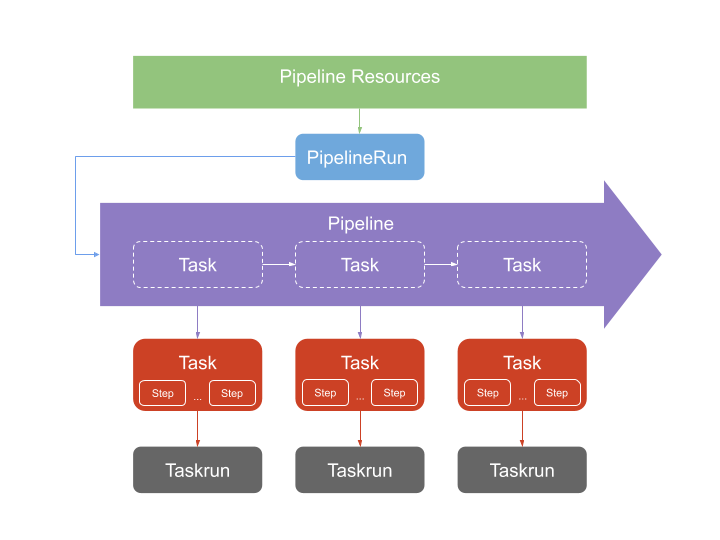

# TekTon CI-CD Example (With GitHub)
## Overview Components




## Install Tekton
```
kubectl apply --filename https://storage.googleapis.com/tekton-releases/pipeline/previous/v0.41.0/release.yaml
```
## Install Tekton Dashboard

```
kubectl apply --filename https://storage.googleapis.com/tekton-releases/dashboard/previous/v0.30.0/tekton-dashboard-release.yaml
```

> Note: Forward tekton dashboard on your local machine
> `kubectl port-forward -n tekton-pipelines service/tekton-dashboard 9097:9097`

## Install Tekton Triggers
```
kubectl apply --filename https://storage.googleapis.com/tekton-releases/triggers/previous/v0.22.0/release.yaml
kubectl apply --filename https://storage.googleapis.com/tekton-releases/triggers/previous/v0.22.0/interceptors.yaml
```

# Configure Triggers

### Create Namespace

```
kubectl create namespace builder
```

### Create Admin Role

```
kubectl -n builder apply -f ./rbac/admin-role.yaml
```

### Create webhook

```
kubectl -n builder apply -f ./Trigger/github-webhook-secret.yaml
kubectl -n builder apply -f ./Trigger/github-binding.yaml
kubectl -n builder apply -f ./Trigger/github-template-clone-build-push.yaml
kubectl -n builder apply -f ./Trigger/github-listener.yaml
```

### Create Ingress for the webhook

```
kubectl -n builder apply -f ./resources/ingress-triggers.yaml
```

### Create Tasks

```
kubectl -n builder apply -f ./Task/task-git-clone.yaml
kubectl -n builder apply -f ./Task/task-show-git-files.yaml
kubectl -n builder apply -f ./Task/task-kaniko.yaml
```

### Create Pipeline
```
kubectl -n builder apply -f ./Pipeline/pipeline-clone-build-push.yaml
```
> Note: Each pipeline have a associate task which was created in the previous step
